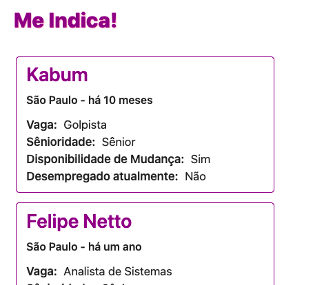

## meindica_lambda
### Lambda em JavaScript para consumo, processamento dos dados e retorno de informações em formato JSON a partir de um arquivo tabelado online.

Esse projeto foi criado com o intuito de testar e praticar o consumo de um arquivo tabelado (Google Math no caso) online gerado a partir de um formulario do google, para que se possa consumir as infos em formato JSON a partir de uma API REST exposta por um serviço Lambda, na AWS.
 
----------
 
Você pode interagir com o projeto a partir do "fiddle" abaixo:
 
